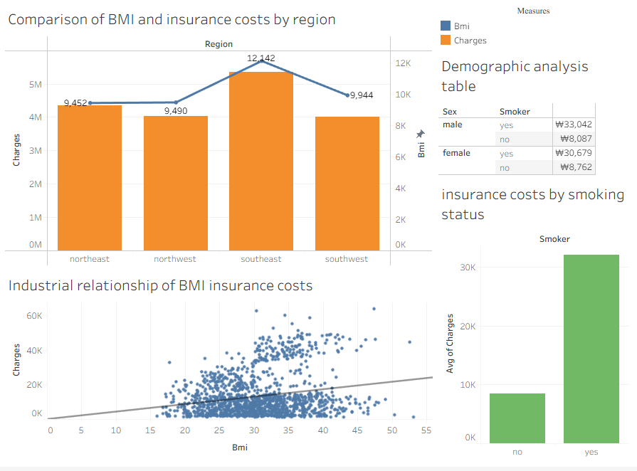

Insurance Cost Analysis Project

Project Overview
This is a personal data analysis project conducted using Tableau to analyze factors affecting insurance costs. The final dashboard version is saved as . Through visualized analysis, the following insights were derived:

Key Findings
1. Regional Comparison of BMI and Insurance Costs
Chart Description: Combined bar and line chart comparing BMI (Body Mass Index) and insurance charges across four regions (northeast, northwest, southeast, southwest)
Key Observations:

Southeast region shows the highest values for both BMI (12,142) and insurance costs (over 5 million)
Northeast and Northwest have similar BMI levels, but Northeast has slightly higher insurance costs
Southwest region shows relatively lower values for both BMI and insurance costs

2. Correlation Between BMI and Insurance Costs (Scatter Plot)
Chart Description: Scatter plot with trend line showing the relationship between BMI and insurance charges
Key Observations:

There is a general upward trend indicating that insurance costs tend to increase with higher BMI
However, the data distribution is quite spread out, suggesting the relationship is more complex than a simple linear correlation
Insurance costs vary significantly within the BMI range of 20-35

3. Insurance Cost Differences by Smoking Status
Chart Description: Bar chart comparing average insurance costs between smokers and non-smokers
Key Observations:

Smokers have significantly higher insurance costs compared to non-smokers (approximately 3+ times higher)
Smoking status appears to be a critical factor influencing insurance premiums

4. Demographic Analysis Table
Table Content: Average insurance costs categorized by gender and smoking status
Key Observations:

Male smokers have the highest insurance costs (₩33,042)
Female smokers also have substantially higher costs compared to non-smokers
Non-smokers show similar, relatively low insurance costs regardless of gender

Comprehensive Analysis
Primary Insights:

BMI Impact: While BMI and insurance costs show a positive correlation, BMI alone cannot fully explain insurance cost variations
Regional Variations: Significant differences exist across regions, with Southeast showing particularly high values for both metrics
Smoking as Key Factor: Smoking status has the most dramatic impact on insurance costs, with clear differences when combined with gender demographics
Multi-factor Influence: Insurance costs are influenced by multiple interacting factors rather than single variables

Business Implications:

Insurance companies should prioritize smoking status in risk assessment
Regional factors warrant further investigation for pricing strategies
BMI should be considered as one of multiple health indicators rather than a standalone predictor
Gender-specific smoking patterns require differentiated approaches in policy design

Limitations and Future Research:

Additional variables (age, medical history, occupation) could provide more comprehensive insights
Causal relationships need further statistical validation
Regional differences require deeper analysis to identify underlying factors
Longitudinal data could reveal trends over time

Methodology

Tool: Tableau for data visualization and analysis
Approach: Multi-dimensional analysis using various chart types
Focus: Identifying key cost drivers and their interactions
