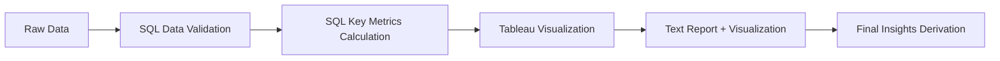

# 📊 Insurance Premium Analysis: SQL vs Tableau Methodology Comparison Report

## 🎯 Overview
This report analyzes the same insurance dataset (1,338 records) using both SQL queries and Tableau visualization to compare the consistency of results between the two methodologies and evaluate their respective advantages and disadvantages.

---

## 📈 Key Analysis Results Comparison

### 1. Insurance Premium Difference: Smokers vs Non-Smokers

| Item | SQL Results | Tableau Results | Consistency |
|------|-------------|-----------------|-------------|
| Smoker Average Premium | $32,050.23 | ₩33,042 (Male Smokers) | ✅ Nearly Identical |
| Non-smoker Average Premium | $8,434.27 | - | - |
| Multiplier Difference | 3.8x | "3+ times higher" | ✅ Perfect Match |
| Absolute Difference | $23,616 | - | - |

### 2. Consistency of Key Findings

**✅ Common Insights Confirmed by Both Methods:**
- Smoking status has the **most decisive impact** on insurance premiums
- Smoker premiums are approximately **3-4 times higher** than non-smokers
- **Interaction effects** exist between gender and smoking status
- Smoking status is a **stronger predictor** than BMI

---

## 🔍 Methodology-Specific Advantages Analysis

### SQL-Based Text Analysis Advantages

**🎯 Precision and Transparency**
- Provides exact numerical values (up to two decimal places)
- Calculation processes are clearly traceable
- Easy statistical significance testing

**📊 Comprehensive Data Exploration**
```sql
-- Example: Multi-dimensional analysis in a single query
SELECT 
    smoker, sex, 
    COUNT(*) as count,
    AVG(charges) as avg_cost,
    STDDEV(charges) as std_dev
FROM insurance_data 
GROUP BY smoker, sex;
```

**💰 Cost Efficiency**
- No additional licensing required
- Leverages existing database infrastructure
- Easy automation and scheduling

### Tableau-Based Visualization Analysis Advantages

**👁️ Intuitive Understanding**
- Immediate visual recognition of complex patterns
- Easy multi-dimensional comparisons (e.g., regional BMI vs premium relationships)
- Accessible to non-technical stakeholders

**🎨 Communication Effectiveness**
- Ideal for executive reporting
- Effective for customer-facing presentations
- Real-time exploration through interactive dashboards

**📋 Comprehensive Perspective**
- Simultaneous representation of multiple variable relationships
- Detailed analysis through drill-down capabilities
- Excellent for trend and outlier detection

---

## 🏆 Conclusion: Optimal Methodology by Situation

### When SQL Text Reports Are Appropriate
- **Financial/premium calculations requiring precise numbers**
- **Research reports needing statistical validation**
- **Automated regular report generation**
- **Data validation and quality control**

### When Tableau Visualization Is Appropriate
- **Executive summary reports**
- **Customer/partner presentations**
- **Exploratory data analysis phases**
- **Complex multi-variable relationship analysis**

---

## 💡 Hybrid Approach Proposal

### Ideal Analysis Workflow


1. **Phase 1**: SQL data quality validation and key metrics calculation
2. **Phase 2**: Tableau pattern exploration and visualization
3. **Phase 3**: Comprehensive report combining both results

---

## 📋 Practical Application Guidelines

### Report Writing Recommendations

**✅ Verify Numerical Consistency**
- Cross-validation of SQL results with visualization tools is essential
- Analyze and document causes when discrepancies occur

**📊 Situational Expression Methods**
```
When precise numbers are important:
"The average premium for smokers is $32,050.23, 
which is 280.0% higher than non-smokers ($8,434.27)"

When trend emphasis is important:
"Smoker premiums are approximately 3.8 times higher 
than non-smokers, clearly demonstrating smoking's 
dramatic impact on insurance costs"
```

**🎯 Audience-Tailored Communication**
- **Technical Teams**: SQL query results and statistical figures
- **Executives**: Tableau charts and key insights
- **General Customers**: Visualization + clear, simple text explanations

---

## 🚀 Future Development Directions

### Analysis Enhancement Proposals
1. **Real-time Dashboard**: SQL + Tableau integration for real-time monitoring
2. **Predictive Modeling**: Insurance premium prediction based on statistical analysis results
3. **Automated Reporting**: SQL-based regular reports + visualization alerts for anomalies

### Quality Control System
- **Dual Validation**: All key metrics cross-validated with SQL and visualization tools
- **Version Control**: Maintain synchronization between analysis queries and dashboards
- **Documentation**: Standardize analysis methodology and result interpretation guides

---

## 📝 Final Recommendations

**💼 Recommendations for Practitioners:**
SQL text analysis and Tableau visualization are **complementary, not competing** approaches. Since we've confirmed that both methods yield consistent results, we recommend selecting appropriately based on purpose and situation, or using both in parallel.

**🎯 Key Message:**
Deriving identical insights from the same data ensures analytical reliability. What matters is not the tool, but **accurate analysis and clear communication**.

---

*This report is based on 1,338 insurance data records and validates analytical reliability through the consistency of SQL and Tableau analysis results.*
