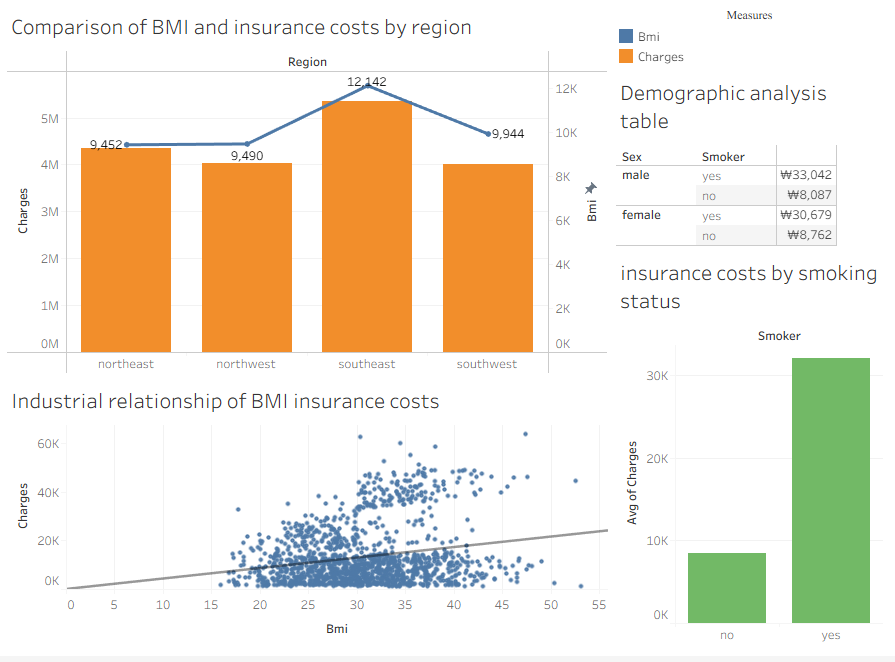

# 📊 Insurance Cost Analysis Project

## 🎯 Project Overview
This is a personal data analysis project conducted using **Tableau** to analyze factors affecting insurance costs. The final dashboard version is saved as `2nddraftmedical.PNG`. 



Through visualized analysis, the following insights were derived:

---

## 🔍 Key Findings

### 1. 🌍 Regional Comparison of BMI and Insurance Costs
**Chart Description:** Combined bar and line chart comparing BMI (Body Mass Index) and insurance charges across four regions (northeast, northwest, southeast, southwest)

**Key Observations:**
- ✅ **Southeast region** shows the highest values for both BMI (12,142) and insurance costs (over 5 million)
- ✅ **Northeast and Northwest** have similar BMI levels, but Northeast has slightly higher insurance costs
- ✅ **Southwest region** shows relatively lower values for both BMI and insurance costs

### 2. 📈 Correlation Between BMI and Insurance Costs (Scatter Plot)
**Chart Description:** Scatter plot with trend line showing the relationship between BMI and insurance charges

**Key Observations:**
- ✅ There is a general **upward trend** indicating that insurance costs tend to increase with higher BMI
- ⚠️ However, the data distribution is quite spread out, suggesting the relationship is more complex than a simple linear correlation
- 📊 Insurance costs vary significantly within the BMI range of 20-35

### 3. 🚬 Insurance Cost Differences by Smoking Status
**Chart Description:** Bar chart comparing average insurance costs between smokers and non-smokers

**Key Observations:**
- 🔥 **Smokers** have significantly higher insurance costs compared to non-smokers (**approximately 3+ times higher**)
- ⚡ **Smoking status** appears to be a critical factor influencing insurance premiums

### 4. 👥 Demographic Analysis Table
**Table Content:** Average insurance costs categorized by gender and smoking status

**Key Observations:**
- 🏆 **Male smokers** have the highest insurance costs (₩33,042)
- 📊 **Female smokers** also have substantially higher costs compared to non-smokers
- ✅ **Non-smokers** show similar, relatively low insurance costs regardless of gender

---

## 💡 Comprehensive Analysis

### 🎯 Primary Insights:

| Factor | Impact Level | Key Finding |
|--------|-------------|-------------|
| **BMI Impact** | 🟡 Moderate | While BMI and insurance costs show a positive correlation, BMI alone cannot fully explain insurance cost variations |
| **Regional Variations** | 🟠 Significant | Significant differences exist across regions, with Southeast showing particularly high values for both metrics |
| **Smoking Factor** | 🔴 Critical | Smoking status has the most dramatic impact on insurance costs, with clear differences when combined with gender demographics |
| **Multi-factor Influence** | 🟢 Complex | Insurance costs are influenced by multiple interacting factors rather than single variables |

### 🏢 Business Implications:
- 🎯 Insurance companies should **prioritize smoking status** in risk assessment
- 🗺️ Regional factors warrant **further investigation** for pricing strategies
- ⚖️ BMI should be considered as **one of multiple health indicators** rather than a standalone predictor
- 👫 Gender-specific smoking patterns require **differentiated approaches** in policy design

### 🔬 Limitations and Future Research:
- ➕ Additional variables (age, medical history, occupation) could provide more comprehensive insights
- 📊 Causal relationships need further statistical validation
- 🌍 Regional differences require deeper analysis to identify underlying factors
- ⏰ Longitudinal data could reveal trends over time

---

## 🛠️ Methodology

| Aspect | Details |
|--------|---------|
| **Tool** | 📊 Tableau for data visualization and analysis |
| **Approach** | 🔄 Multi-dimensional analysis using various chart types |
| **Focus** | 🎯 Identifying key cost drivers and their interactions |

---

## 📈 Dashboard Components

```
┌─────────────────┬─────────────────┐
│  Regional BMI   │   Demographics  │
│  & Cost Chart   │   Analysis      │
├─────────────────┼─────────────────┤
│  BMI vs Cost    │   Smoking       │
│  Scatter Plot   │   Cost Impact   │
└─────────────────┴─────────────────┘
```

---

*This analysis provides valuable insights for insurance industry professionals and data science enthusiasts interested in healthcare cost modeling.*

Tool: Tableau for data visualization and analysis
Approach: Multi-dimensional analysis using various chart types
Focus: Identifying key cost drivers and their interactions

Data Source: 
- Kaggle Dataset: "Medical Cost Personal Datasets" by mirichoi0218 
  (https://www.kaggle.com/datasets/mirichoi0218/insurance)
- Original Source: Lantz, B. "Machine Learning with R"
